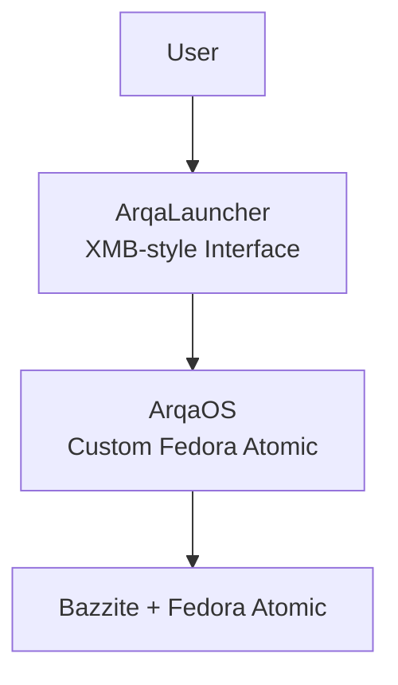

# Arqa-Core

> Bringing retro gaming back to life on modern Linux

Welcome to Arqa-Core. We're an open-source project building a beautiful, focused retro gaming and emulation platform. Our goal is to make classic games feel great again by combining clean design, solid technology, and interfaces that just work.

## What We're Building

Arqa-Core is creating a complete ecosystem for emulation, from the base operating system and hardware all the way to the launcher you actually use. We want to make retro gaming accessible and enjoyable without the usual tinkering, while keeping everything beautiful looking and feeling cohesive.

### Core Values

- **Emulation First** — Built for games, not a general-purpose desktop
- **Looks Matter** — Everything follows one clean visual language
- **No Fuss** — It should just work, especially with a gamepad
- **Community Focused** — Open source and welcoming to contributors at any level
- **Modular** — Components that play nicely together

## Our Projects

### 1. ArqaOS

The foundation of the whole platform.

- **Base**: Fedora Atomic (bootc) derivative built on Bazzite
- **Goal**: A ready-to-go Linux system optimized for emulation kiosks and living-room setups
- **Highlights**:
  - Wayland compositor (Cage) for stability
  - Automatic kiosk login
  - Custom Plymouth boot animation
  - Built-in ArqaLauncher
  - Easy image building (ISO, QCOW2, raw disk)

**Quick Start**:
```bash
git clone https://github.com/Arqa-Core/ArqaOS.git
cd ArqaOS
just build
```

  

### 2. ArqaLauncher

The interface you'll actually see and use.

- **Tech**: Electron + React (fullscreen)
- **Style**: Heavy PS3 XMB inspiration — horizontal, flowing, nostalgic but modern
- **Features**:
  - Automatic ROM scanning
  - Gamepad-first navigation
  - Support for RetroArch, Dolphin, PCSX2, and more
  - Fully offline
  - Clean settings system

**Quick Start**:
```bash
git clone https://github.com/Arqa-Core/ArqaLauncher.git
cd ArqaLauncher
npm install
npm start
```

  

### 3. Other Projects (In Progress / Planned)

- **ArqaThemes** — Theme engine and community themes (in development)
- **ArqaCore** — Shared utilities and types
- **ArqaDocs** — Central documentation
- **ArqaSync** — Cloud save sync (early concept)

## How It All Fits Together



## Visual Style

Everything follows a dark, moody PS3 XMB-inspired aesthetic:

- **Main Background**: `#05030c`
- **Gradient Accents**: Deep purples and blues
- **Highlight Color**: `#8a54ff` (with glow)
- **Text**: Bright `#eef0ff` for primary, darker tones for secondary

This palette is used across the boot screen, launcher, wallpapers — everything. When contributing, please keep the visuals consistent.

  
*(You can host a simple palette image or use a public CC0 retro UI mockup)*

## Getting Started

### For Users

1. Grab the latest ISO from [Releases](https://github.com/Arqa-Core/ArqaOS/releases)
2. Write it to a USB:
   ```bash
   dd if=arqaos-latest.iso of=/dev/sdX bs=4M status=progress
   ```
3. Boot it up — it should drop you straight into the launcher

### For Developers

You'll need: Linux (or WSL2), `just`, `podman`/`docker`, and `npm`.

```bash
git clone https://github.com/Arqa-Core/ArqaOS.git
git clone https://github.com/Arqa-Core/ArqaLauncher.git

cd ArqaOS
npm install --prefix ../ArqaLauncher
just build-dev
```

## Contributing

We love contributions! Whether it's code, themes, documentation, or just testing and feedback.

**The basics**:
- Fork the repo
- Make a branch
- Keep the visual style consistent
- Test your changes
- Open a PR with a clear description

We follow standard practices: shellcheck for scripts, ESLint for JS, etc.

## Tech Stack (Quick Overview)

**ArqaOS**: Fedora Atomic + bootc, Cage Wayland, SDDM, Plymouth, Podman builds  
**ArqaLauncher**: Electron 42 + React 18, pure CSS animations, Electron Forge packaging

## Roadmap

- **Now**: Stabilizing core OS + launcher, fixing bugs, gathering feedback
- **Q3 2026**: Theme engine, multi-profile support, performance work
- **Later**: Cloud saves, community theme sharing, remote management tools

## Community

- Issues & Discussions: [github.com/Arqa-Core](https://github.com/Arqa-Core)
- Discord: Coming soon

All projects are licensed under **GPL V3.0**.

---

**Made with passion by the Arqa-Core community**  
*Last updated: June 2026*
